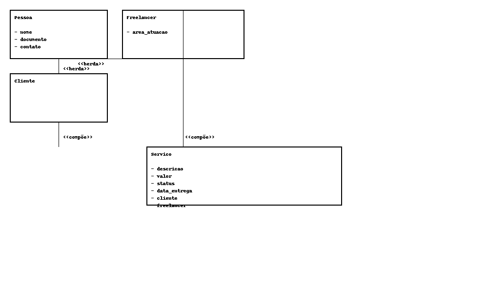

# Freelancer Manager

**Sistema de Gerenciamento de Freelancers e Serviços**  
Disciplina: Orientação a Objetos (UnB Gama – 01/2025)  
Professor: Henrique Moura

---

## 🎯 Objetivo

Este projeto visa oferecer uma solução para freelancers autônomos organizarem seus serviços, prazos, pagamentos e clientes de forma eficiente. A aplicação é orientada a objetos e implementa princípios fundamentais da disciplina.

---

## ✅ Casos de Uso

### 1. Cadastrar Freelancer
- Informar: nome, CPF/CNPJ, contato e área de atuação.

### 2. Cadastrar Cliente
- Informar: nome, CPF/CNPJ e contato.

### 3. Criar Serviço
- Informar: descrição, valor, data de entrega.
- Selecionar: cliente e freelancer.

### 4. Atualizar Status de Serviço
- Modificável via backend (extensível).

### 5. Listar Relatórios
- Listar freelancers, clientes e serviços.

### 6. Salvar e Carregar Dados
- Serialização automática via `pickle`.

---

## 🧠 Estrutura do Projeto

```
freelancer_manager/
├── main.py
├── README.md
├── data/
│   └── db.pkl
├── gui/
│   └── app.py
├── package/
│   ├── banco_dados.py
│   ├── cliente.py
│   ├── freelancer.py
│   ├── mixins.py
│   ├── pessoa.py
│   ├── servico.py
│   └── sistema.py
└── diagrama_classes.png
```

---

## 🛠️ Tecnologias

- Python 3
- `tkinter` + `ttkbootstrap` (interface gráfica moderna)
- `pickle` (persistência)
- POO (herança, polimorfismo, mixins, composição)

---

## 📷 Diagrama de Classes



---

## 🚀 Execução

```bash
pip install ttkbootstrap
python main.py
```

---

## 💾 Observações

- Todos os dados são salvos automaticamente em `data/db.pkl`
- Projeto funcional e pronto para extensões futuras (edição de serviços, filtros etc.)
